# Tarno OS

Tarno OS ist ein extrem gestripptes, Linux-basiertes System (Buildroot), das
für Low-RAM-Betrieb, minimalen Gaming-Overhead und einen eigenen
`tarnod`-Sicherheitsdaemon optimiert ist — ohne den Aufwand eines eigenen
Kernels.

- **Plan/Übersicht:** [`ROADMAP.md`](ROADMAP.md)
- **Technische Details je Monat + Architektur:** [`docs/`](docs/)

## Repo-Struktur

| Pfad | Zweck |
|---|---|
| [`tarnod/`](tarnod/) | Root-Daemon (`tarnod`), CLI-Client (`tarnoctl`), natives GUI (`tarnod-ui`) — Rust-Workspace |
| [`tarno-guard-ebpf/`](tarno-guard-ebpf/) | eBPF-Behavioral-Security (Tracepoint auf `execve`, RingBuf-Events, Userspace-Loader) |
| [`scripts/`](scripts/) | Gaming-Mode-Tuning (CPU-Governor, THP, JVM-Start-Wrapper, FPS-Benchmark) |
| [`tarno-br2-external/`](tarno-br2-external/) | Buildroot-`BR2_EXTERNAL`-Tree (Kernel-Config, `tarnod`-Package, Board-Support M6700, USB-Boot-Image) |
| [`tarno-installer/`](tarno-installer/) | Natives GUI zum Schreiben des USB-Boot-Images auf einen Stick (läuft auf dem Alltags-Rechner, nicht auf Tarno OS selbst) |
| [`tarno-desktop/`](tarno-desktop/) | **Primäre OS-Experience**: eigener Wayland-Compositor (smithay) mit fusionierter Taskleiste, `tarnod-ui` als integrierte Settings-App. `cage` bleibt nur als dedizierter Gaming-Vollbild-Pfad (Dual-Mode, siehe [`docs/architecture.md`](docs/architecture.md#dual-mode-gaming-vs-desktop)) |
| [`tarno-ui-theme/`](tarno-ui-theme/) | Geteiltes egui-Theme für `tarnod-ui`, `tarno-installer` und `tarno-desktop` |
| [`docs/`](docs/) | Architektur + detaillierte Monatspläne mit Befehlen/Configs/Abnahmekriterien |

## Schnellstart (Entwicklung, ohne Buildroot)

```sh
cd tarnod
cargo build --workspace
cargo test --workspace
./target/debug/tarnod &         # TARNOD_DRY_RUN=1 für Sandboxes ohne echte cpufreq/THP-Pfade
./target/debug/tarnoctl ping
./target/debug/tarnod-ui        # natives GUI (egui/eframe), verbindet sich auf denselben Socket
```

eBPF-Feature (Behavioral Security) aktivieren — braucht root/`CAP_BPF`+`CAP_PERFMON`
und einen Kernel mit BTF, siehe [`tarno-guard-ebpf/BPF_LINKER.md`](tarno-guard-ebpf/BPF_LINKER.md)
für den Toolchain-Aufbau:

```sh
cargo build --workspace --features tarnod/ebpf
TARNOD_DENY_LIST="cryptominer" ./target/debug/tarnod
```

USB-Installer bauen und starten (schreibt ein `sdcard.img` auf einen
Wechseldatenträger — **root nötig**, siehe Sicherheitsmodell in
[`docs/architecture.md`](docs/architecture.md#tarno-installer-natives-gui-läuft-nicht-auf-tarno-os-selbst)):

```sh
cd tarno-installer
cargo build --release
cargo test              # Kopier-Engine + Geräte-Erkennung, ohne root testbar
sudo ./target/release/tarno-installer
```

**Stick von Windows aus erstellen?** `tarno-installer` läuft nativ auch
auf Windows — am einfachsten mit
[`scripts/windows/build-tarno-installer.ps1`](scripts/windows/build-tarno-installer.ps1)
(ein Doppelklick/Aufruf, prüft und installiert Git/Rust bei Bedarf
selbst). Details: [`tarno-installer/README.md#windows-nutzung`](tarno-installer/README.md#windows-nutzung).

**Die eigentliche `sdcard.img` bauen** (das Tarno-OS-Image selbst, nicht
der Installer): `.github/workflows/build-os-image.yml` per GitHub Actions
manuell auslösen (Actions-Tab → "Build Tarno OS image" → "Run workflow")
— läuft komplett auf GitHub-Infrastruktur, kein eigener Linux-Rechner
nötig. Dauert je nach Paketumfang etwa eine bis mehrere Stunden, Ergebnis
liegt danach als Artifact zum Download bereit.

Desktop-Modus (primäre OS-Experience, eigener Compositor + Taskleiste,
`tarnod-ui` als integrierte Settings-App — siehe
[`tarno-desktop/README.md`](tarno-desktop/README.md)):

```sh
cd tarno-desktop
cargo build
cargo test
mkdir -p /tmp/xdg-runtime && chmod 0700 /tmp/xdg-runtime
# tarnod-ui muss im $PATH liegen (oder TARNO_DESKTOP_SETTINGS_BIN setzen),
# damit ein Klick auf die TARNO-Wordmark in der Taskleiste sie als
# Settings-Fenster öffnen kann.
XDG_RUNTIME_DIR=/tmp/xdg-runtime ./target/debug/tarno-desktop
```

Details, Architektur-Begründungen und der Status je Roadmap-Meilenstein:
siehe [`docs/architecture.md`](docs/architecture.md).

## Screenshots

Alle Screenshots sind unter Xvfb aufgenommen (native egui-Screenshot-API
bzw. `xwd` für `tarno-desktop`, siehe [`docs/architecture.md`](docs/architecture.md)),
gegen einen echten laufenden `tarnod` im Dry-Run — keine Mockups. Windows
11 Fluent Design, dunkel, Cyan-Akzent (`#0BC7FF`), siehe Begründung in
[`tarno-ui-theme/`](tarno-ui-theme/).

### `tarnod-ui` — Steuerung für Gaming-Mode & Security

| Dashboard | Gaming-Mode |
|---|---|
| 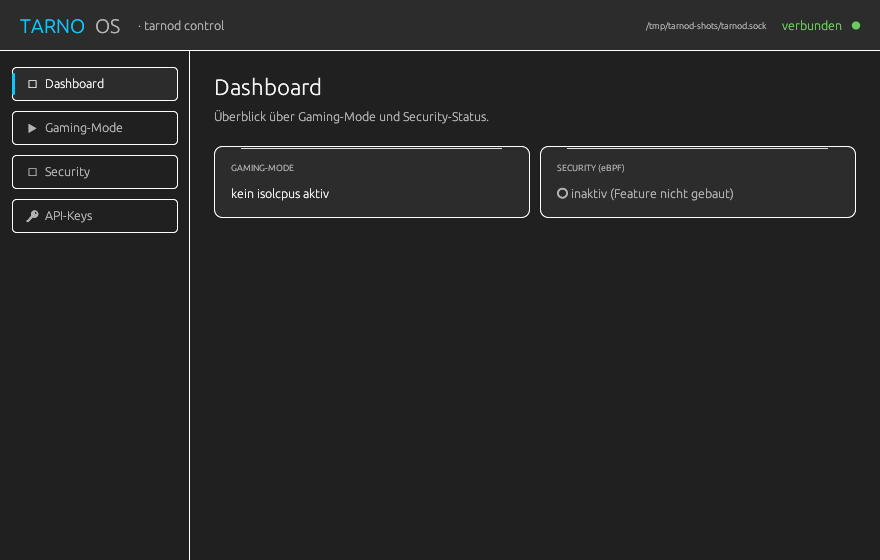 | 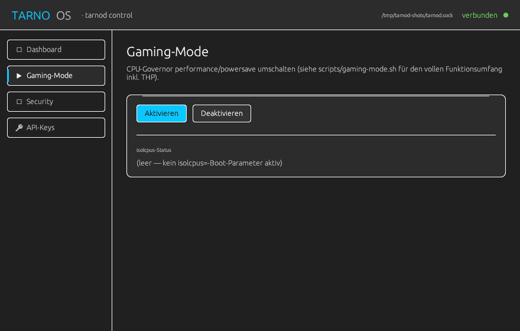 |

| Security | API-Keys |
|---|---|
| 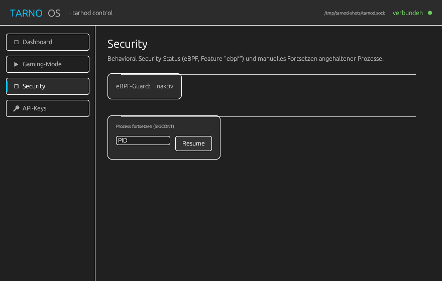 | 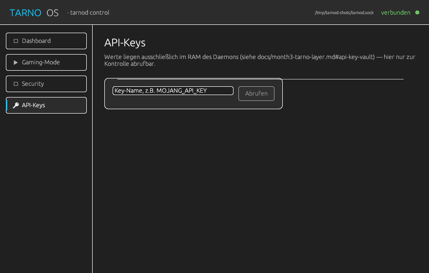 |

### `tarno-installer` — USB-Boot-Image schreiben

| Bereit | Bestätigung |
|---|---|
| 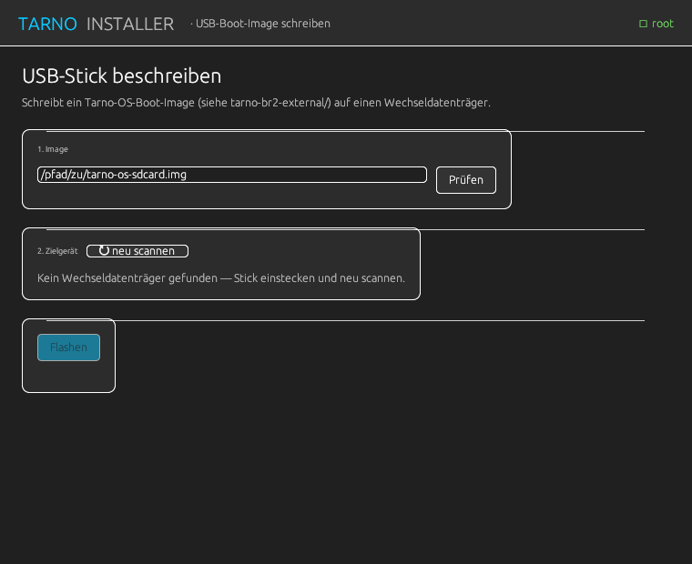 | 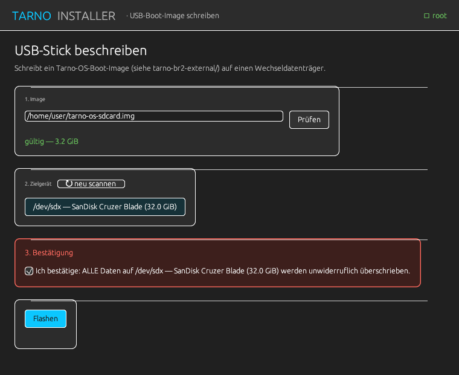 |

| Läuft | Fertig | Fehler |
|---|---|---|
| 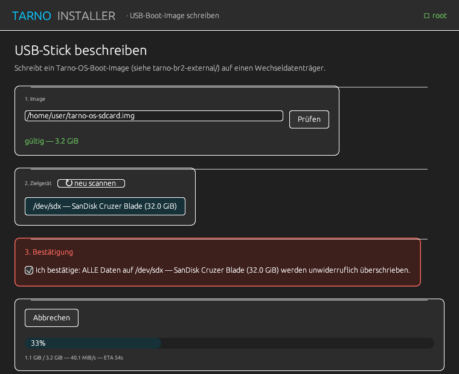 | 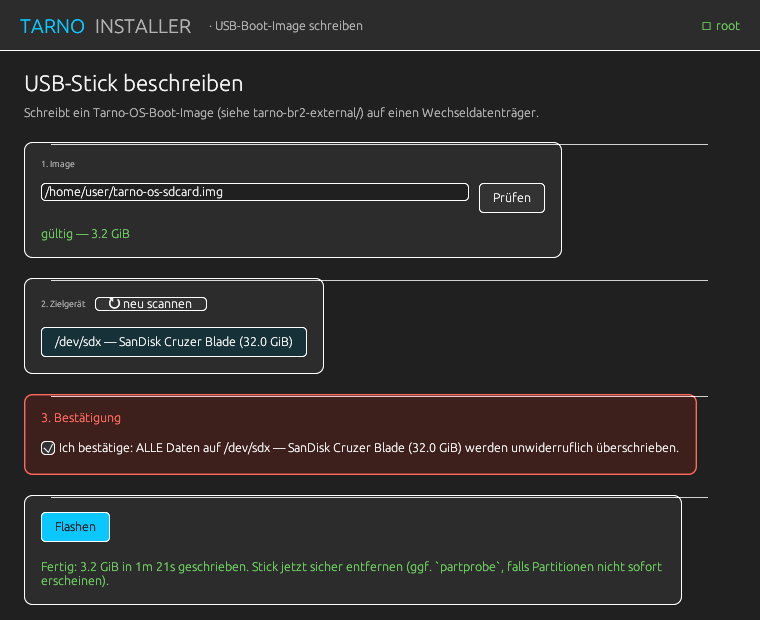 | 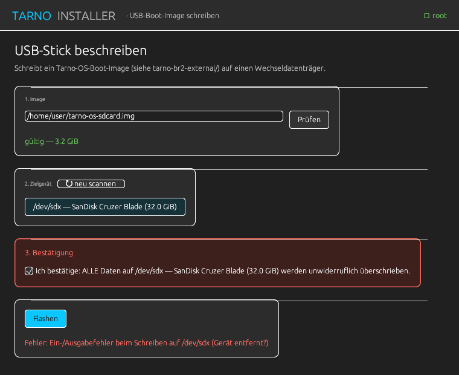 |

### `tarno-desktop` — primäre OS-Experience: Compositor + Taskleiste + Settings

| Desktop | Settings-App per Klick geöffnet |
|---|---|
| 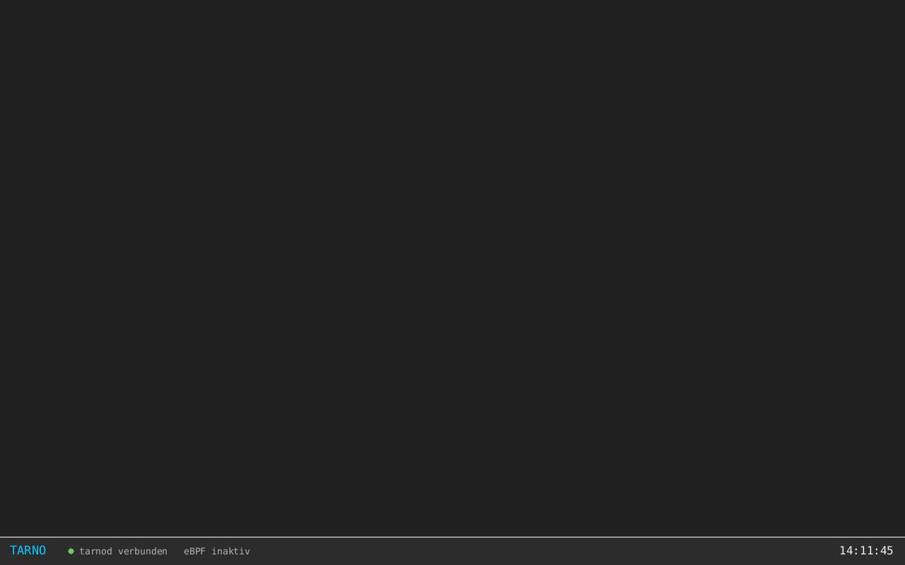 | 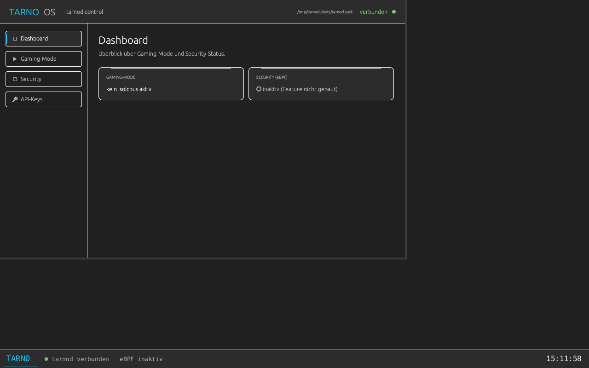 |

Taskleiste (unten): Wordmark (klickbar — öffnet die Settings-App),
`tarnod`-Verbindungsstatus, `isolcpus`- und eBPF-Status, laufende Uhrzeit —
alles live vom echten Daemon, kein statischer Platzhalter. Rechts: ein
Klick auf die Wordmark spawnt `tarnod-ui` als echten Wayland-Client, der
als Fenster innerhalb des Compositors rendert — die einzige
Einstellungs-Oberfläche von Tarno OS. Details: [`tarno-desktop/README.md`](tarno-desktop/README.md).